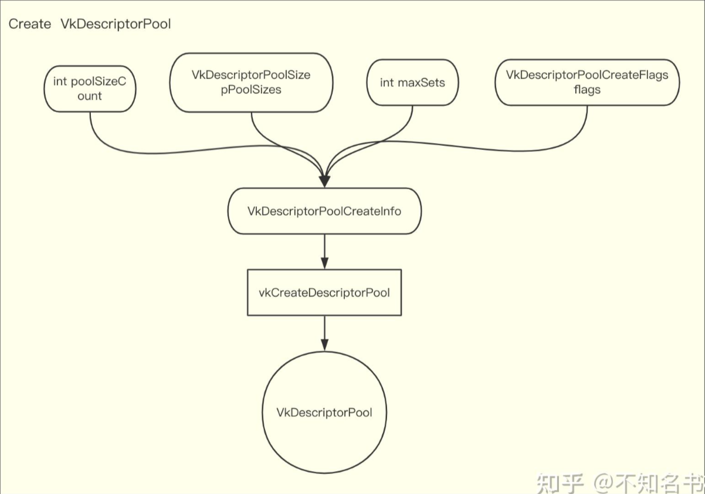
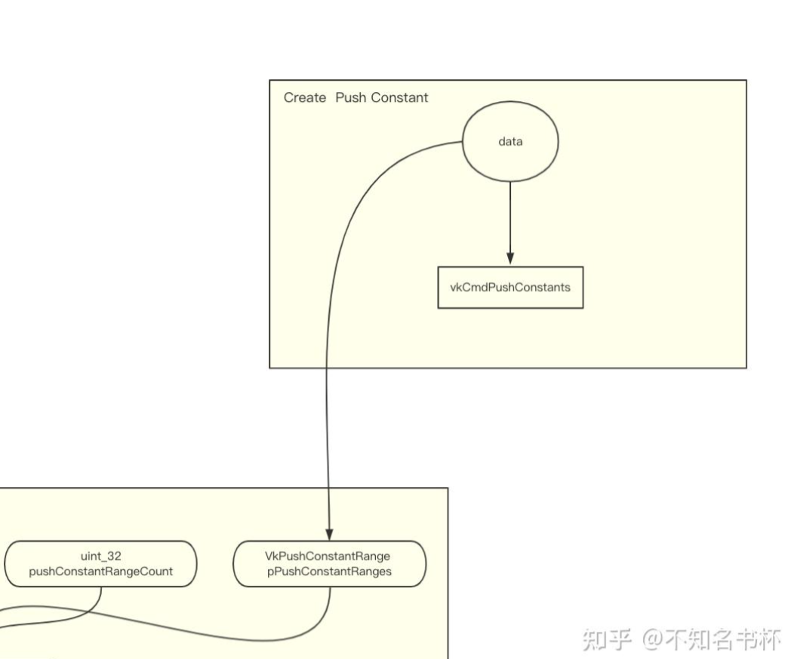
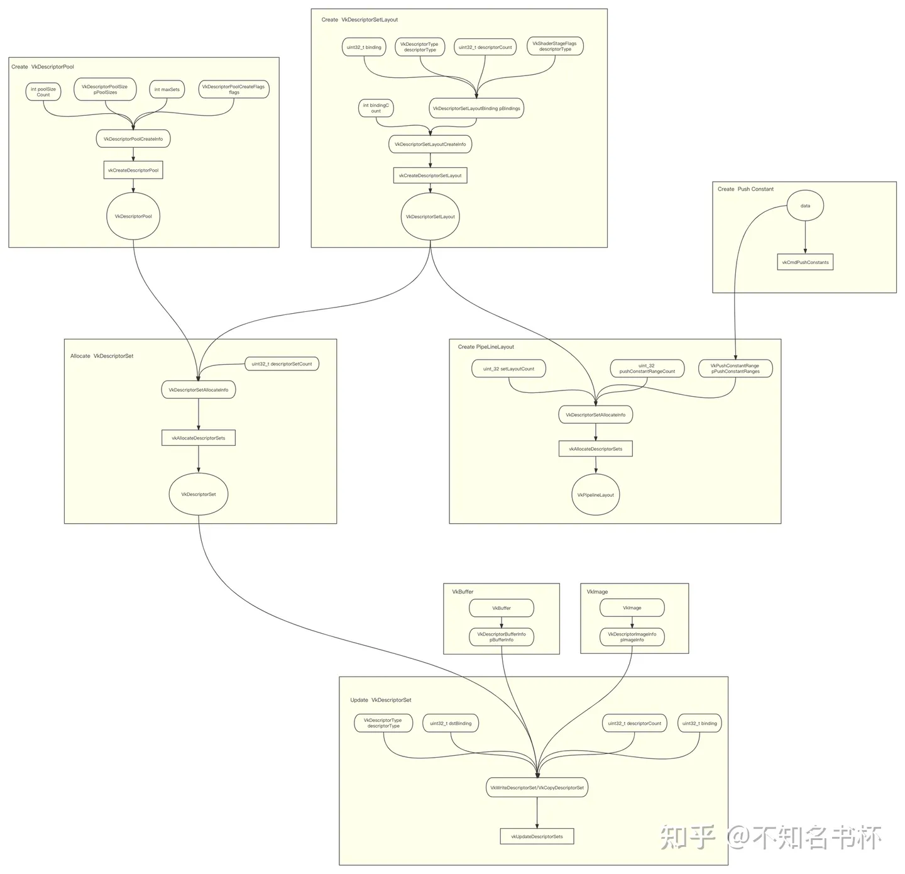
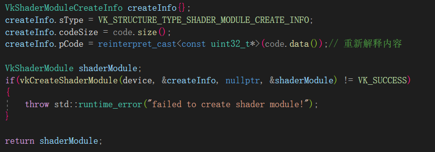
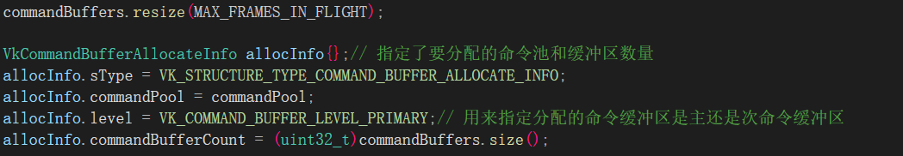
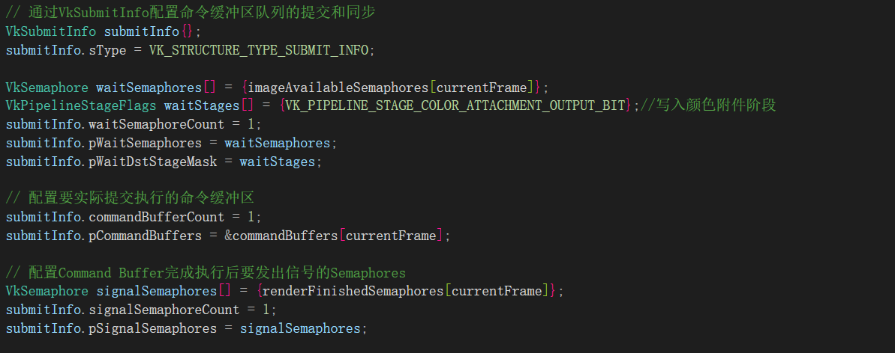

## Vulkan绘制三角形

在Vulkan当中的画一个三角形流程可以分为如下:

- 创建一个 VkInstance
- 选择支持的硬件设备（VkPhysicalDevice）
- 创建用于Draw和Presentation的VkDevice 和 VkQueue
- 创建窗口(window)、窗口表面(window surface)和交换链 (Swap Chain)
- 将Swap Chain Image 包装到 VkImageView
- 创建一个指定Render Target和用途的RenderPass
- 为RenderPass创建FrameBuffer
- 设置PipeLine
- 为每个可能的Swap Chain Image分配并记录带有绘制命令的Command Buffer
- 通过从Swap Chain获取图像在上面绘制，提交正确的Commander Buffer，并将绘制完的图像返回到Swap Chain去显示。

### **Semaphores**

**Semaphores用于在GPU队列操作之间增添顺序**。队列操作是指我们提交给队列的工作，可以是在Command Buffer中，也可以是在函数中，我们稍后会看到。在我们这里Queue分别是Graphics Queue和Presentation Queue。Semaphores用于对同一队列内和不同队列之间的工作进行控制。

Semaphore要么是无信号的，要么是有信号的。它以没有信号的方式开始。

我们使用semaphore对队列操作进行排序的方式是在一个队列操作中提供发出Semaphore相同的信号量，在另一个队列操作中提供与等待semaphore相同的信号量。

例子代码:

```C++
VkCommandBuffer A, B = ... // record command buffers
VkSemaphore S = ... // create a semaphore

// enqueue A, signal S when done - starts executing immediately
vkQueueSubmit(work: A, signal: S, wait: None)

// enqueue B, wait on S to start
vkQueueSubmit(work: B, signal: None, wait: S)
```

请注意，在此代码片段中，对 vkQueueSubmit() 的两个调用都会立即返回 - **等待仅发生在 GPU 上**。 CPU 继续运行而不会阻塞。为了让 CPU 等待，我们需要一个不同的同步原语，我们现在将对其进行描述

### **Fence**

Fence也有类似的作用，它被用来同步执行，但它是为了**在CPU侧上控制执行顺序**。简单地说，如果主机需要知道GPU什么时候完成了什么，我们就使用Fence。

与Semaphore类似，Fence也是处于有信号或无信号的状态。每当我们提交要执行的工作时，我们可以为该工作附加一个Fence。当工作完成后，Fence将被发出信号。然后，我们可以让主机等待Fence发出信号，保证在主机继续工作之前工作已经完成。

一个具体的例子是拍摄屏幕截图。假设我们已经在GPU上完成了必要的工作。现在需要把图像从GPU上传到主机上，然后把内存保存到文件中。我们有执行传输的Command Buffer A和Fence F。我们用 Fence F提交Command Buffer A，然后立即告诉主机等待F的信号。这导致主机阻塞，直到Command Buffer A执行完毕。因此，我们可以安全地让主机将文件保存到磁盘，因为内存传输已经完成。

上面说的的伪代码如下所示

```cpp
VkCommandBuffer A = ... // record command buffer with the transfer
VkFence F = ... // create the fence

// enqueue A, start work immediately, signal F when done
vkQueueSubmit(work: A, fence: F)

vkWaitForFence(F) // blocks execution until A has finished executing

save_screenshot_to_disk() // can't run until the transfer has finished
```

与Semaphore的例子不同，这个例子会阻止主机的执行。这意味着主机除了等待执行完毕外不会做任何事情。在这个例子中，我们必须确保在将屏幕截图保存到磁盘之前，传输已经完成。

Fence必须被手动重置，以使其恢复到无信号的状态。这是因为Fence是用来控制主机的执行的，所以主机可以决定何时重置Fence。与此相对应的是Semaphores，它是用来命令GPU上的工作而不需要主机参与。

综上所述，Semaphores用于指定GPU上操作的执行顺序，而Fence则用于保持CPU和GPU之间的同步性。

Swap Chain操作和等待前一帧完成。我们希望将Semaphore用于Swap Chain操作，因为它们发生在 GPU 上，因此如果我们可以提供帮助，我们不想让主机等待。为了等待前一帧完成，我们想使用Fence，因为我们需要主机等待。这样我们就不会一次绘制超过一帧。

# 资源绑定

- Descriptor
- Descriptor Set
- Descriptor Set Layout
- Descriptor Binding
- Pipeline Layout
- Push Constant

### Descriptor

Descriptor是一个不透明的数据结构，代表一个着色器资源，如Buffer、Buffer View、Imgae、Sampler、Combined Image Sampler。Descriptor不是无意义的概念，Vulkan将通过**Descriptor告诉GPU这些资源在哪里，以及着色器该如何访问这些资源**。其实也就是认为Descriptor为一个句柄(Handle)或者一个指向资源的指针。

Descriptor会被组织成DescriptorSet，在Command Record过程中被绑定，以便在随后的DrawCall中使用。每个DescriptorSet的内容安排是由DescriptorSet Layout决定的，它决定了哪些Descriptor可以被存储在其中。

**DescriptorSet Layout**：该对象描述了每个着色器阶段的DescriptorSet中的包含哪些Binding。例如在Binding 0 处定义一个由顶点和片段阶段使用的Uniform Buffer，在Binding 1处定义一个Storage Buffer，在Binding2处定义一个仅用于片段阶段的Image。

**PipelineLayout**：由于一个Pipeline可以绑定多个DescriptorSet，这个对象定义了每个DescriptorSet对应哪些DescriptorSetLayout。

与传统图形API基于插槽的绑定模型不同。在Vulkan中如何将资源传递给着色器方面有更多的自由。资源将组合为DescriptorSet并具有指定的布局，并且**每个着色器可以使用多个DescriptorSet并可以单独绑定**(DescriptorSet最少需要一个Descriptor)。开发者有责任管理DescriptorSet，以确保CPU不会更新GPU正在使用的DescriptorSet，并提供DescriptorSet Layout，在CPU端更新成本和GPU端访问成本之间实现最佳平衡。

建议利用不同的DescriptorSet以避免多余的资源绑定更新。把许多更新频率非常不同的资源放在同一个DescriptorSet中对整体性能不利。比如一个DescriptorSet有几个Texture和Uniform Buffer，其中只有一个资源需要变化，但仍需要更新整个DescriptorSet这将导致大量的数据被发送到GPU，而这些大部分数据实际上什么都没有修改。并且假如有大量资源需要绑定的话，可以通过一个DescriptorSet即可完成绑定。

### 创建DescriptorPool

创建流程




### 创建DescriptorSetLayout

DescriptorSetLayout是由零个或多个DescriptorBinding定义的。每个DescriptorBinding由VkDescriptorType代表什么类型的Descriptor、DescriptorCount(数组大小)、可以访问该绑定的着色器阶段stageFlags。还有binding字段是对应该绑定DescriptorSet其中的Index。可以对应于着色器阶段中不同binding的资源。DescriptorSetLayout的创建流程图如下所示：


**DescriptorSetLayout**本质上是DescriptorBindings的集合。**Descriptor binding**可以是一个Texture Descriptor、Buffer Descriptor或者Sampler Descriptor等等。正是通过DescriptorBinding，DescriptorSet才实现了Shader和资源的绑定，方便了Shader对资源的读写操作。在Shader可以根据相对应的Binding去访问到相应的数据。

### 分配DescriptorSet


### DescriptorSet绑定

已经完成分配DescriptorSet但是还没有真正的数据绑定，接下来将数据绑定到DescriptorSet上。如下流程图所示。通过VkWriteDescriptorSet将真实的资源(Buffer,Image，Sampler)绑定到DescriptorSet中Binding中。最后通过vkUpdateDescriptorSets更新该DescriptorSet。到这里就完成了整个关于DescriptorSet的设置。


### PipeLineLayout

还有一个问题需要解决，就是**不同Pipeline会需要用到什么DescriptorSet**。以及Pip**eline怎么知道DescriptorSetLayout**？这个时候就需要请出PipelineLayout了。从Pipeline能够绑定DescriptorSet是通过PipelineLayout完成的。**零个或多个DescriptorSetLayout和PushConstRange组合起来就是一个PipelineLayout**如下图所示，**PipelineLayout也就是描述可以被Pipeline访问的所有资源**。**每个Pipeline都是使用PipelineLayout创建的**。==在着色器当中只能够访问到在PipelineLayout中DescriptorSet中绑定的资源。==


创建流程


通过之前设置好的DescriptorSetLayout 设置


### Push Constant

在PipelineLayout当中有看到一个VkPushConstantRange结构，也就是指定Push Constant布局。先介绍Push Constant。Push Constant可以让一种非常简单和有效的方式向着色器发送少量的数据(它有大小限制)。**Push Constant可以向任何着色器阶段发送数据，并存储在CommandBuffer本身**。Push Constant比UBO/SSBO快得多，但一个巨大的限制是数据的大小,规范要求Push Constant范围必须在128字节以内。不同的硬件供应商可能会支持更多，但与其他手段(UBO)相比，它能够传递的数据量仍然是非常小的。流程图如下：



### Vulkan Binding Model

理解完上面概念后，现在将其组合起来就可以初步整理出Vulkan的Binding Model。

- DescriptorSetLayout由Descriptor Binding组成，会控制每个Descriptor的排列方式。
- Descriptor Binding将Descriptor和shader进行绑定，给shader提供了对资源操作的接口。
- DescriptorSet需要指定DescriptorSetLayout最后由DescriptorPool来真正分配出来。
- 通过VkWriteDescriptorSet/VkCopyDescriptorSet来真正将资源绑定或者更新数据。
- PipelineLayout通过DescriptorSetLayout以及PushConst创建并完成整个PipeLine的数据绑定。
- 最后使用vkCmdBindDescriptorSets完成对于DescriptorSet的绑定。





### 对上面的一个总结

#### 1 设置DescriptorSetLayoutBinding信息

DescriptorSetLayoutBinding是一个Descriptor的集合，定义了着色器上的Uniform结构布局，其参数如下：


1. binding：类似于索引的存在，标记binding=0这一块区域，用来进行标识
2. descriptorType：描述的是Descriptor的类型
3. descriptorCount：描述有几个Descriptor（不确定）
4. stageFlags：指定Descriptor将在哪个着色器阶段被引用
5. pImmutableSamplers

#### 2 创建 DescriptorSetLayout 

DescriptorSetLayout是由零个或多个DescriptorBinding定义的。

VkDescriptorSetLayoutCreateInfo所需的设置如下，其中参数的含义比较明显


由此，我们便有了DescriptorSetLayout 


#### 3 创建Descriptor Pool

在Vulkan当中是通过VkDescriptorPool来管理所有的DescriptorSet并分配DescriptorSet。

VkDescriptorPoolCreateInfo所需的参数如下所示：


下面说下里面比较关键的两个参数：

1. maxSets限制该pool最多能够分配多少个DescriptorSet

建立对应的Descriptor Pool后，我们需要依据DescriptorSetLayout从中分配（Allocate）一些Descriptors。
正如图中所示，红色的“Allocate”引用了DescriptorSetLayout。在DescriptorSetLayout的指导下，利用Descriptor Pool提供的Descriptors，组装成一个符合DescriptorSetLayout的Set（即图中红色的DescriptorSet A）


#### 4 分配DescriptorSet

通过VkDescriptorSetAllocateInfo指定相应的VkDescriptorSetLayout和VkDescriptorPool去分配DescriptorSet：


除此之外descriptorSetCount代表需要创建DescriptorSet的个数

由此完成分配DescriptorSet但是还没有真正的数据绑定

#### 5 DescriptorSet绑定数据

通过VkWriteDescriptorSet将真实的资源(Buffer，Image，Sampler)绑定到DescriptorSet中Binding中。最后通过vkUpdateDescriptorSets更新该DescriptorSet。


下面解释一下VkWriteDescriptorSet所需的信息

- dstSet：指定要写入的DescriptorSet
- dstBinding：绑定我们的索引，这个索引和DescriptorSetLayoutBinding中的binding是对应的
- dstArrayElement：0 <= ArrayElement < DescriptorSetLayoutBinding0.Count，表示写入Array中的第几个对象，这里我们只想写入index=1位置（对应DescriptorSetA.Bind0.DescriptorArray[1]）
- descriptorType：再次指定Descriptor类型
- descriptorCount：可以在一个数组中一次更新多个Descriptor，从索引dstArrayElement开始。descriptorCount字段指定了你要更新多少个数组元素。
- pBufferInfo：绑定VkDescriptorBufferInfo

而VkDescriptorBufferInfo这个结构指定了Buffer以及其中包含Descriptor数据的区域。

由此，通过vkUpdateDescriptorSets更新信息

#### 6 运行时绑定DescriptorSet

用vkCmdBindDescriptorSets为每一帧实际绑定正确的Descriptor Set到着色器中实际的Descriptor


# Vulkan管线(Pipeline)

在Vulkan主要有三种类型的管线ComputePipeline和GraphicsPipeline和Ray tracing pipeline。
三种Pipeline其中包含了PipelineLayout，PipelineLayout指定了Pipeline使用那些DescriptorSetLayout和Push Constant的

GraphicsPipeline包含了所有的参数，如顶点、片段、几何、计算和曲面细分着色器(如果启用了该功能的话)，再加上像顶点属性、输入装配、图元结构、光栅化参数、深度/模板测试参数、面剔除和Blend Const、视口(ViewPort)参数还有RenderPass等，Vulkan会将这些状态固定成一个大的、不可更改的对象。 这样所有的状态组合的验证和编译都可以在初始化的时候完成，运行时不会再因为这些操作有任何性能上的浪费。

对于渲染过程中需要的每一组不同的参数，必须创建一个新的Pipeline。可以通过调用函数vkCmdBindPipeline将其设置该CommandBuffer Scope内绑定该Pipeline。并且提供了Dynamic State给Pipeline提供了一定的灵活性,修改Dynamic State可以避免重新创建一个Pipeline以减少开销。

## Pipeline创建流程

创建一个Pipeline需要完善VkGraphicsPipelineCreateInfo，其结构体声明如下：


### Shader Module

在Pipeline当中通过VkPipelineShaderStageCreateInfo字段设置Shader。Vulkan与早期的API不同，Vulkan中的着色器代码必须以字节码格式指定，而不是像GLSL和HLSL那样的人类可读语法。这种字节码格式被称为SPIR-V。使用字节码格式的好处是，由GPU供应商编写的将着色器代码转化为本地代码的编译器的复杂程度明显降低。**将Shader转成SPIR-V之后，需要将其转化为VkShaderModule才可以在Vulkan中使用**，通过VkShaderModuleCreateInfo来创建VkShaderModule，指定一个指向带有字节码指针pCode和它的长度codeSize。然后通过vkCreateShaderModule得到VkShaderModule，接下来继续瞄准VkPipelineShaderStageCreateInfo。

- stage字段指定是一个VkShaderStageFlagBits值，指定一个Pipeline阶段(比如顶点着色器或者片段着色器或者曲面细分)。
- module字段是一个VkShaderModule对象，包含这个阶段的Shader。
- pName字段是一个指向空尾UTF-8字符串的指针，指定此阶段的Shader的主函数名称。
- pSpecializationInfo字段是一个指向VkSpecializationInfo结构的指针或者为空。


而这个VkShaderModule具体所指为：


### Vertex Input State

VkPipelineVertexInputStateCreateInfo结构体如下所示，这个主要是指定顶点数据相关


- VkVertexInputBindingDescription：数据之间的间隔以及数据，按顶点还是按实例化通过VkVertexInputRate区分。
- VkVertexInputAttributeDescription：传递给顶点着色器的属性类型，从哪个绑定处加载它们，在哪个偏移处加载。

VkVertexInputBindingDescription所需设置的信息如下：


VkVertexInputAttributeDescription所需设置如下：


VkPipelineVertexInputStateCreateInfo所需设置如下：


### Input Assembly State

该状态一般也缩写为IA，VkPipelineInputAssemblyStateCreateInfo结构描述了两件事：

- topology字段将决定从顶点绘制什么样的几何图形，如Point, Line, TriangleList等。
- primitiveRestartEnable字段决定是否应启用图元复用，可以配合Index Buffer使用来复用顶点数据。

设置如下：


[topology](https://registry.khronos.org/vulkan/specs/1.3-extensions/man/html/VkPrimitiveTopology.html)

### Viewports and Scissors

VkPipelineViewportStateCreateInfo结构是用来描述Viewport属性以及Scissors属性。

- pViewport字段描述了渲染结果输出将被渲染到的FrameBuffer的区域。minDepth和maxDepth值指定了用于Frame Buffer的深度值的范围。
- pScissors字段定义了像素将被实际存储在哪些区域。剪切矩形之外的任何像素都会被光栅化器丢弃。它们的功能就像一个过滤器，而不是一个转换。

我们对其的设置分为两步，先是在初始化时指定其数量，然后在渲染时具体指定值


### Rasterization State

VkPipelineRasterizationStateCreateInfo结构描述了光栅化如何处理顶点着色器中获取由顶点形成的几何体并且会将其转化为像素的过程，从它还执行Depth Test、Face Cull和Scissors Test，它可以被配置为输出填充整个多边形或只是边缘的片段(线框渲染）。

- rasterizerDiscardEnable字段如果设置为VK_TRUE，那么将不会有任何几何体能够通过光栅化阶段。
- depthClampEnable字段被设置为VK_TRUE，那么超出近平面和远平面的片段就会被夹在其中，而不是丢弃。在生成ShadowMap的过程会被用到。
- polygonMode字段决定了如何为几何体填充像素区域。如果需要线框渲染可以通过将polygonMode设为VK_POLYGON_MODE_LINE来实现。
- cullMode字段决定了面剔除的配置，可以禁用或者背面剔除或者前面剔除或两者兼用。frontFace变量规定了被视为正面的顶点顺序，可以是顺时针或逆时针。这将影响面剔除的结果。
- depthBiasEnable字段决定是否开启深度偏置，
- depthBiasConstantFactor是一个常量，控制添加到每个片段的的固定深度值。
- depthBiasClamp是一个片段的最大(或最小)深度偏差。depthBiasSlopeFactor是一个常量，在深度偏差计算中应用于片段的斜率。这个将会在软阴影的实现中用到。


### Multisample State

VkPipelineMultisampleStateCreateInfo配置了MSAA是否开启以及Sample数量的设置，这是反走样的经典方法之一。

- rasterizationSamples字段是一个VkSampleCountFlagBits值，指定在光栅化中使用的样本数。
- sampleShadingEnable字段决定是否启用Sample Shading。Sample Shading可以完成平滑颜色变化过大的锯齿。
- minSampleShading字段指定了在sampleShadingEnable设置为VK_TRUE的情况下采样着色的最小次数。
- pSampleMask字段是一个指针，指向用于采样Mask测试的VkSampleMask值数组。
- alphaToCoverageEnable字段控制是否根据多样本覆盖部分中指定的片段的第一颜色输出的alpha分量生成临时覆盖值。
- alphaToOneEnable字段控制是否按照多样本覆盖部分所述，将片段的第一个颜色输出的alpha分量替换成一个。


### Depth Stencil State

VkPipelineDepthStencilStateCreateInfo用来描述深度/模板测试的配置。

- depthTestEnable字段指定是否应将新片段的深度与Depth Buffer进行比较，看它们是否应被丢弃。
- depthWriteEnable字段指定是否应将通过深度测试的新片段的深度实际写入Depth Buffer。
- depthCompareOp字段指定了为保留或丢弃片段所进行的如何去比较。一般来说较低的深度=较近的惯例，所以新片段的深度应该较小。
- depthBoundsTestEnable字段用于可选的深度边界测试是否开启。基本上，这允许你只保留落在指定深度范围内的片段。
- minDepthBounds字段用于深度边界测试的最小深度。
- maxDepthBounds字段用于深度边界测试的最大深度。
- stencilTestEnable字段指定是否开启Stencil Test。
- fron和back字段指定关于StencilTest的配置。

### PipelineLayout

Pipeline还需要PipelineLayout来指定相应Push Const的使用以及VkDescriptorSetLayout，相当于指定了这个Pipeline能够使用的资源是什么。具体设置就是上面的内容了

最主要的关系是我们通过VkDescriptorSetLayout去设置PipelineLayout，而在着色器当中只能够访问到在PipelineLayout中DescriptorSet中绑定的资源。


### RenderPass and Subpass

在Pipeline的同样需要Renderpass作为参数以及指定使用的是哪个subpass来生成。

## Pipeline优化原则

### Dynamic State

# Vulkan渲染通道(RenderPass)

- RenderPass
- SubPass
- Attachment
- Framebuffer
- Subpass Dependency

## RenderPass

### 简介

RenderPass同样是现代图形API提出的新概念，简单来说RenderPass是整个Render Pipeline的一次执行。RenderPass本质是定义一个完整的渲染流程以及使用的所有资源的描述，可以理解为是一份元数据或者占位符的概念其中不包含任何真正的数据。

在Vulkan中不能在没有RenderPass的情况下渲染任何东西。而且**每个RenderPass必须有一个或多个子步骤**。这些子步骤被称为SubPass，**每个SubPass都是使用RenderPass中定义的资源描述**。

RenderPass的资源可能包括 Color、Depth/Stencil、Resolve Attachment和Input Attachment(潜在地在同一RenderPass的上一个SubPass中产出的同样属于RenderPass的资源)，而这些资源被称为Attachment。
为什么不直接把它们叫做RenderTarget呢？因为Attachment只是资源描述(元数据)定义一些加载/存储操作以及相应资源的格式。

RenderPass其实是通过Framebuffer中包含的ImageView拿到真正的数据(牢记RenderPass只是元数据)。并且之后的RenderPass中只要满足Vulkan定义的Render Pass Compatibility要求的Framebuffer，Framebuffer就能通过RenderPass渲染出相应的结果。

### 总结

RenderPass描述了所有使用的资源描述(也就是Attachment)并且定义一个明确的渲染流程，这给驱动程序足够的信息去做一些优化。尤其是在Attachment相关设置能够使用驱动程序对于内存开销做出更多的优化。

RenderPass被分为一个或多个SubPass，SubPass之间有明确定义的依赖关系。这种显式配置的VkRenderPass可以在渲染操作之间共享，这可以限制对现实世界的复杂应用的影响。

并且SubPass对于Tile Base架构下的GPU有很大的优势，可以通过SubPass可以将其操作全部都On-Chip内存上完成，不仅速度快而且避免了带宽的损耗并提高整体性能。并且在不同的移动端的硬件中也有着不同的优化Feature，在这里SubPass各种优化手段是碎片化的(比如Mail的TE)。要根据不同的GPU做不同的设置需要去兼容。

## Subpass

SubPass在不同的GPU架构会有不一样的意义，在传统的桌面IMR架构GPU上，SubPass只不过是语法糖，本质上可以认为是一个一个RenderPass还会拿一整张FrameBuffer来进行操作。但是到了Tile Base GPU架构之下。SubPass就会有重要的性能优化作用。

## 创建RenderPass

需要填充VkRenderPassCreateInfo结构体来创建VkRenderPass。


### VkAttachmentDescription

一个Attachment对应于一个VkImageView。
在创建RenderPass时需要提供Attachment描述，VkAttachmentDescription结构就是对应Attachment描述，这样可以对RenderPass进行适当的配置。

RenderPass可以通过Framebuffer来获得实际的Image。可以将多个Attachment与一个RenderPass联系起来。这些Attachment可以作为多个RenderTarget或者用于单独的SubPass。

在Vulkan中Color 和Depth是相互独立的Attachment。因此VkRenderPassCreateInfo的pAttachments成员指向一个Attachment数组。用来指定RenderPass内包含所有的Attachment描述。


- format字段制定该Attachment的格式。
- samples字段是一个VkSampleCountFlagBits值，指定图像的Sample Count属性。为了配合MSAA使用。
- loadOp字段是一个VkAttachmentLoadOp值，指定在首次使用Attachment的SubPass加载时如何处理的Color或者Depth组件的内容。
- storeOp字段是一个VkAttachmentStoreOp值，指定在最后使用该Attachment的SubPass结束时如何存储其Color或者Depth组件的内容。
- stencilLoadOp字段是一个VkAttachmentLoadOp值，指定在第一次使用的SubPass加载时如何处理Attachment的Stencil组件的内容。
- stencilStoreOp是一个VkAttachmentStoreOp值，指定在最后一个使用SubPass结束时如何存储Attachment的Stencil组件的内容。
- initialLayout字段是指RenderPass实例开始时Attachment Image子资源的布局。
- finalLayout字段是指当RenderPass实例结束时Attachment Image子资源将被转换到的布局。

### VkAttachmentLoadOp包含的类型

- ==VK_ATTACHMENT_LOAD_OP_LOAD==指定了在渲染区域内图像的先前内容将被保留。对于Depth/Stencil Attachment则使用VK_ACCESS_DEPTH_STENCIL_ATTACHMENT_READ_BIT访问类型。对于Color Attachment则使用VK_ACCESS_COLOR_ATTACHMENT_READ_BIT访问类型。
- ==VK_ATTACHMENT_LOAD_OP_CLEAR==指定了在渲染区域内图像将被清除为指定值。对于Depth/Stencil Attachment则使用VK_ACCESS_DEPTH_STENCIL_ATTACHMENT_WRITE_BIT访问类型。对于Color Attachment则使用VK_ACCESS_COLOR_ATTACHMENT_WRITE_BIT访问类型。
- ==VK_ATTACHMENT_LOAD_OP_DONT_CARE==指定了在渲染区域内前一次内容不需要被保留。其中Attachment的内容将未定义。对于具有Depth/Stencil Attachment则使用VK_ACCESS_DEPTH_STENCIL_ATTACHMENT_WRITE_BIT访问类型。对于Color Attachment则使用VK_ACCESS_COLOR_ATTACHMENT_WRITE_BIT访问类型。
- ==VK_ATTACHMENT_LOAD_OP_NONE_EXT==指定了在渲染区域内图像的先前内容将被保留，但Attachment的内容在RenderPass内将是未定义的。由于不访问图像，因此不使用任何访问类型。

### VkAttachmentStoreOp包含的类型

- ==VK_ATTACHMENT_STORE_OP_STORE==指定了在渲染区域中的内容将被写入内存。对于Depth/Stencil Attachment则使用VK_ACCESS_DEPTH_STENCIL_ATTACHMENT_WRITE_BIT访问类型。对于Color Attachment使用VK_ACCESS_COLOR_ATTACHMENT_WRITE_BIT访问类型。
- ==VK_ATTACHMENT_STORE_OP_DONT_CARE==指定了在渲染区域内的内容在渲染后不再需要并可以被丢弃。区域内的Attachment内容将未定义。对于Depth/Stencil Attachment使用VK_ACCESS_DEPTH_STENCIL_ATTACHMENT_WRITE_BIT访问类型。对于Color Attachment使用VK_ACCESS_COLOR_ATTACHMENT_WRITE_BIT访问类型。
- ==VK_ATTACHMENT_STORE_OP_NONE==指定渲染区域内的内容不被存储操作所访问。然而，如果Attachment在渲染过程中被写入，那么Attachment内容在渲染区域内将是未定义的。

VK_ATTACHMENT_STORE_OP_DONT_CARE可能会导致在到达内存之前丢弃在之前的RenderPass中生成的内容，即使在当前RenderPass中未对Attachment进行写入操作。

这个机制有一个需要注意的复杂问题：考虑一下渲染一个有两个RenderPass的场景，第二个RenderPass将第一个RenderPass的结果(用STORE_OP_STORE)作为Input Attachment(LOAD_OP_LOAD)但不向它写入。如果这个Input Attachment在第二个RenderPass之后仍然需要，那么它必须仍然与STORE_OP_STORE相关联：使用STORE_OP_DONT_CARE会导致一些硬件进行优化并在第二个RenderPass结束后丢弃该Attachment内容，即使第一个RenderPass使用了STORE_OP_STORE标识。可以将其视为第一个RenderPass输出内容被丢弃，尽管之前该内容是被认为有效的。这是一种潜在的良好性能提升，但这意味着用户需要准备好接受出乎意料的行为！

### VkAttachmentReference

在这里通过VkAttachmentReference结构为SubPass指定使用在RenderPass中包含的具体的哪个Attachment。并且SubPass之间Attachment的布局可能会发生变化，因此需要在每个SubPass的基础上通过layout字段来描述。


- attachment是一个整数值，用于识别VkRenderPassCreateInfo::pAttachments中相应索引的Attachment或者是VK_ATTACHMENT_UNUSED，表示这个Attachment没有被使用。
- layout字段是一个VkImageLayout值，指定该Attachment在该SubPass中使用的布局。

### VkSubpassDescription

在这里通过VkSubpassDescription来描述RenderPass中的每个SubPass的属性。


- flags字段是一个VkSubpassDescriptionFlagBits的位掩码，用于指定SubPass的用途。
- pipelineBindPoint是一个VkPipelineBindPoint值，指定该SubPass支持的Pipeline类型。
- inputAttachmentCount字段是指InputAttachment的数量。
- pInputAttachments字段是一个指向VkAttachmentReference数组的指针，定义该SubPass需要的Input Attachment及对应布局。
- colorAttachmentCount字段是指Color Attachment的数量。
- pColorAttachments字段是一个指向VkAttachmentReference数组的指针，该结构定义了该SubPass需要的Color Attachment及对应布局。
- pResolveAttachments字段是NULL或一个指向VkAttachmentReference结构数组的指针，该结构定义了该SubPass的Resolve Attachment及其布局。在开启MSAA时会用到。
- pDepthStencilAttachment字段是一个指向VkAttachmentReference指针，指定该SubPass的Depth/Stencil Attachment及其布局。
- preserveAttachmentCount字段是需要保留Attachment数量。
- pPreserveAttachments字段是一个指向Attachment数组的指针，这些Attachment在当前的SubPass中未使用，但其内容必须在整个SubPass期间保持不变。


### VkSubpassDependency

通过VkSubpassDependency来描述RenderPass中不同SubPass之间或同一个SubPass的内存和执行同步依赖。换句话说就是指定SubPass之间的依赖描述


- srcSubpass字段是第一个SubPass的索引或者是VK_SUBPASS_EXTERNAL。
- dstSubpass字段是第二个SubPass的索引。
- srcStageMask字段是一个VkPipelineStageFlagBits，用于指定源阶段掩码。
- dstStageMask字段是一个VkPipelineStageFlagBits，用于指定目标阶段掩码。
- srcAccessMask字段是VkAccessFlagBits，用于指定源访问掩码。
- dstAccessMask字段是VkAccessFlagBits，用于指定目标访问掩码。

通过srcSubpas和dstSubpass可以段指定了依赖关系和依赖SubPass的索引。
VK_SUBPASS_EXTERNAL是RenderPass之前或之后的隐式SubPass。dstSubpass必须总是比srcSubpass高，以防止依赖中的循环(除非其中一个SubPass是VK_SUBPASS_EXTERNAL)。并且如果 srcSubpass等于dstSubpass，那么 VkSubpassDependency就不会直接定义一个依赖关系。如果srcSubpass和dstSubpass不相等，当一个包含SubpassDependency的RenderPass实例被提交到一个队列时，它定义了由srcSubpass和dstSubpass标识的SubPass之间的依赖关系。

### VkFrameBuffer

RenderPass需要与Framebuffer获取到真正的Image才可以渲染出真正的结果。

Framebuffer代表了RenderPass所使用的特定内存的集合，也就是Attachment真正对应的内存。RenderPass只是元数据，真正的Image需要从Framebuffer中获取。

Framebuffer会定义了哪个ImageView是对应到RenderPass的哪个Attachment。ImageView定义了要使用Image的哪一部分。Image定义了哪个物理内存被使用以及Texel的格式。


VkFramebufferCreateInfo结构：


- renderPass是一个VkRenderPass并且定义了Framebuffer将与哪些RenderPass兼容。
- attachmentCount是指Attachment的数量。
- pAttachments是一个指向VkImageView数组的指针，每个句柄将被用作RenderPass中的相应Attachment。如果flags包括VK_FRAMEBUFFER_CREATE_IMAGELESS_BIT，这个参数会被忽略。
- width, height则定义了Framebuffer的尺寸。

Framebuffer中使用的所有Attachment都具有相同的width, height。这个RenderPass是解耦的牢记RenderPass只是元数据，所以同一个RenderPass可以用于不同尺寸的Framebuffer。只要满足RenderPass兼容性即可。

## 使用RenderPass

### 开启RenderPass

在这里**通过vkCmdBeginRenderPass调用来创建一个RenderPass实例**。并且如果一旦一个RenderPass要在Command Buffer中开始，提交给该Command Buffer的后续命令将在该RednerPass实例的第一个SubPass中执行。

vkCmdBeginRenderPass需要填充一个VkRenderPassBeginInfo结构用来指定要开始的RenderPass实例以及该实例使用的Framebuffer。

VkRenderPassBeginInfo结构如下：


- renderPass是要开始使用的RenderPass。
- framebuffer是指包含RenderPass所使用的全部Attachment的Framebuffer。
- renderArea是指受RenderPass影响的渲染区域。
- clearValueCount是pClearValues中元素的数量。
- pClearValues是一个指向VkClearValue结构数组的指针，其中**包含每个Attachment的Clear Value**，如果Attachment使用了loadOp值为VK_ATTACHMENT_LOAD_OP_CLEAR或者如果Attachment有Depth/Stencil格式并且使用了stencilLoadOp值为VK_ATTACHMENT_LOAD_OP_CLEAR。这个数组是以Attachment编号为索引的。只有对应于已清除的VkClearValue的元素被使用。pClearValues的其他元素被忽略。


renderArea用于渲染Framebuffer的一个子集，例如对屏幕上部分区域进行更新。
应用程序负责将渲染结果剪切到这个区域，如果renderArea和Framebuffer没有对齐，这会导致性能下降，这可以通过vkGetRenderAreaGranularity来确定。

对于Tile Base渲染器来说，它可能对应于Tile Grid的对齐。在大多数情况下，renderArea可以被设置为Framebuffer的全部宽度和高度。


### 切换SubPass

在一个RenderPass当中会有一个或者多个SubPass，从上面的vkCmdBeginRenderPass创建RenderPass实例，并且隐式的从第一个SubPass开始运行

可以通过vkCmdNextSubpass去切换到下一个SubPass

RenderPass的SubPass索引从记录vkCmdBeginRenderPass时的零开始，每次记录vkCmdNextSubpass时都会递增。

未解读部分

> 移动到下一个SubPass的操作是会自动执行被结束的SubPass中的任何多重采样Resolve操作。出于同步的目的，SubPass结束时的多重采样Resolve被视为Color Attachment的写入。这适用于Color,Depth/Stencil Attachment的Resolve操作。也就是说，它们被认为是在 VK_PIPELINE_STAGE_COLOR_ATTACHMENT_OUTPUT_BIT管道阶段执行的，它们的写入与 VK_ACCESS_COLOR_ATTACHMENT_WRITE_BIT同步。SubPass内的渲染和SubPass结束时的任何Resolve操作之间的同步会自动发生，不需要明确的依赖关系或Pipeline Barrier。然而如果Resolve Attachment也被用于不同的SubPass，则需要一个显式的依赖关系。
>
> 在过渡到下一个SubPass后，应用程序可以记录该SubPass的命令。比如重新绑定一个Pipeline(一般不同的SubPass也要对应不同的Pipeline)或者调整动态属性或者是提交一些DrawCall。

### 结束RenderPass

在开始RenderPass之后开始记录命令，在全部命令提交到了Command Buffer之后。现在应该就可以结束RenderPass。在这里通过vkCmdEndRenderPass来完成，结束一个RenderPass实例。

### 整体流程


# Vulkan 命令缓冲区(Command Buffer)

## Command Buffer

Vulkan通过Command Buffer完成Record Command的操作。这些Commnad之后会通过Command Buffer被提交到Queue再被提交到GPU中执行。

需要被Record的Command包括：

- 将Pipeline和DescriptorSet绑定到Command Buffer的命令
- 修改Dynamic State
- DrawCall相关的Command(用于图形渲染)
- Dispatch的命令(用于计算)
- 执行Secondary Command Buffer的(仅用于Primary Command Buffer)
- 复制Buffer
- Image的Command
- 其他VkCmdXXXX所有的调用


这样做的好处是，当准备告诉Vulkan我们想要做什么的时候，所有的Command都会一起提交并且在发送给GPU之前会由驱动程序进行小规模的翻译和优化。Vulkan可以更有效地处理这些Command。并且Command Buffer是支持多线程操作的，每一个线程都可以使用Commnad Buffer来Record Command。

## 创建Command Buffer

### 创建Command Pool

在Vulkan中Command Buffer是通过Command Pool来分配的。但Command Pool是一个不透明的对象，由它来分配Command Buffer从而来实现在多个Command Buffer中摊平资源创建的成本。

**Command Pool是外部同步的这意味着一个Command Pool不能在多个线程中同时使用。**

创建Command Pool需要填充VkCommandPoolCreateInfo结构体，并通过调用vkCreateCommandPool来创建真正的Command Pool。


- queueFamilyIndex字段指定一个Queue Family。

- flags字段是VkCommandPoolCreateFlagBits值，分别如下：

- - VK_COMMAND_POOL_CREATE_TRANSIENT_BIT 指定从Pool中分配的Command Buffer将是短暂的，这意味着它们将在相对较短的时间内被重置或释放。这个标志可以被用来控制Pool的内存分配。
  - VK_COMMAND_POOL_CREATE_RESET_COMMAND_BUFFER_BIT允许从Pool中分配的任何Command Buffer被单独重置到Inital状态，可以通过调用vkResetCommandBuffer或者调用vkBeginCommandBuffer时的隐式重置。如果在一个Pool上没有设置这个flag，那么对于从该Pool中分配的任何Command Buffer都不能调用vkResetCommandBuffer。
  - VK_COMMAND_POOL_CREATE_PROTECTED_BIT 指定从Pool中分配的Command Buffer是受保护的Command Buffer。

### 分配Command Buffer

填充VkCommandBufferAllocateInfo这个结构体



- commandPool字段是指定用于分配该Command Buffer的Command Pool。

- level字段是一个VkCommandBufferLevel值，指定Command Buffer的级别。

- - VK_COMMAND_BUFFER_LEVEL_PRIMARY指定一个Primary Command Buffer。
  - VK_COMMAND_BUFFER_LEVEL_SECONDARY指定一个Secondary Command Buffer。

- commandBufferCount字段是指定要从Pool中分配的Command Buffer的数量。

填充完该结构体之后可以通过vkAllocateCommandBuffers来分配Command Buffer。并且vkAllocateCommandBuffers可以一次性分配多个Command Buffer。如果这些Command Buffer其中任何一个分配失败，那么之前已经创建成功的Command Buffer也会被释放掉，将pCommandBuffers数组的所有元素设置为NULL并返回错误。

## 使用Command Buffer

### Record Command

在这里可以通过vkBeginCommandBuffer方法来让Command Buffer准备好Record Command。在这里同样需要填充该结构体。


- flags字段是一个VkCommandBufferUsageFlagBits类型用于指定Command Buffer的使用行为。

- - VK_COMMAND_BUFFER_USAGE_ONE_TIME_SUBMIT_BIT指定Command Buffer的每个Record Command只会提交一次，不会去复用其中任何Command，在每次提交之间Command Buffer将被重置并再次进入Recording状态。
  - VK_COMMAND_BUFFER_USAGE_RENDER_PASS_CONTINUE_BIT指定其中的Secondary Command Buffer被认为是完全在一个RenderPass内。如果这是一个Primary Command Buffer那么这个将会被忽略。
  - VK_COMMAND_BUFFER_USAGE_SIMULTANEOUS_USE_BIT指定一个Command Buffer在Pending状态时可以重新提交给队列，并记录到多个Primary Command Buffer。

- pInitanceInfo是一个指向VkCommandBufferInheritanceInfo结构的指针，如果Command Buffer是一个Secondary Command Buffer则需要使用它。如果这是一个Primary Command Buffer那么这个值将被忽略。后续将会介绍Secondary Command Buffer。

如果Command Buffer处于Inital或Executable状态，并且Command Buffer是从设置了VK_COMMAND_POOL_CREATE_RESET_COMMAND_BUFFER_BIT标志的Command Pool中分配的，那么vkBeginCommandBuffer会隐式重置Command Buffer，其行为就像在没有设置VK_COMMAND_BUFFER_RESET_RELEASE_RESOURCES_BIT的情况下调用vkResetCommandBuffer。在隐式重置后Command Buffer被移到Recording状态。

在调用vkBeginCommandBuffer之后并且Record Command完毕之后便可以结束这个Record，在Vulkan中可以通过调用vkEndCommandBuffer来代表完成Record。

整体流程如下图所示，在调用vkBeginCommandBuffer之后可以调用VkCmdXXXX等各种命令。均会被该Command Buffer记录下来。


### Submit Command

结束Command Buffer的Record Command之后，需要将Command Buffer中的命令提交到Queue当中去执行,在这里可以先补充一下Queue的相关前置知识。

### Queue

Queue通常代表一个GPU线程，GPU执行的就是提交到Queues中的工作。

物理设备中Queue可能不止一个，每一个Queue都被包含在Queue Families中。Queue Families是一个有相同功能的Queue的集合，但是一个物理设备中可以存在多个Queue Families，不同的Queue Families有不同的特性。

相同Queue Families中的Queues所有功能都相同并且可以并行运行，但是会有一个优先级的问题，这个需要慎重考虑(优先级较低的Queue可能会等待很长时间都不会处理)。不同的Queue Families主要分为以下几类(通过VkQueueFlagBits来分类)：

- VK_QUEUE_GRAPHICS_BIT代表其中的Queue都支持图形操作。
- VK_QUEUE_COMPUTE_BIT指代表其中的Queue都支持计算操作。
- VK_QUEUE_TRANSFER_BIT指代表其中的Queue都支持传输操作。
- VK_QUEUE_TRANSFER_BIT指代表其中的Queue都支持稀疏内存管理操作。
- VK_QUEUE_VIDEO_DECODE_BIT_KHR指代表其中的Queue都支持视频解码操作。
- VK_QUEUE_VIDEO_ENCODE_BIT_KHR指代表其中的Queue都支持视频编码操作。

在这里大部分的情况都只需要一个Queue就可以满足需求，Queue基本上是 "提交工作 "和 "等待空闲”的状态。一般来说Command Buffer就会被提交到Queue。Queue再将Command提交到GPU中去执行。

### Queue Submit

在这里通过vkQueueSubmit来完成Command Buffer的提交，需要填充VkSubmitInfo该结构体。



- waitSemaphoreCount是在提交Command Buffer之前要等待的Semaphore的数量。
- pWaitSemaphores是一个指向VkSemaphore数组的指针，在这个Command Buffer前要等待该其中的Semaphore。如果提供了Semaphore则定义了一个等待该Semaphore信号操作。
- pWaitDstageMask是一个指向管道阶段数组的指针，在这个数组中每个相应的semaphore等待将发生。
- commandBufferCount是要在批处理中执行的Command Buffer的数量。
- pCommandBuffers是一个指向在批处理中执行的VkCommandBuffer数组的指针。
- signalSemaphoreCount是在pCommandBuffers中指定的命令执行完毕后，要发出信号的semaphores的数量。
- pSignalSemaphores是一个指向VkSemaphore数组的指针，当这个Command Buffer完成执行时将对其发出信号。如果提供了Semaphore则定义了一个Semaphore发信号的操作。

在这里被提交的Command Buffer在pCommandBuffers中出现的顺序被用来确定提交顺序，因此所有尊重它的隐式排序保证但是这个只是保证开始的顺序，结束执行的顺序不保证。除了这些隐式排序保证和任何显式同步原语外，这些Command Buffer可能会重叠或以其他方式不按顺序执行(也就是乱序执行)。

接下来看到vkQueueSubmit函数吧，这里同样提供了submitCount和pSubmits参数，可以一次性提交多个VkSubmitInfo结构体。vkQueueSubmit是一个很耗时的操作，所以在这里尽量选择一次性提交，避免多次调用vkQueueSubmit。


在这里可以看到VkFence和VkSemaphore这两个对象，这都是Vulkan中的同步原语如下图所示，在这里就只先简单介绍Semaphore和Fence。


- Semaphores主要用于Queue之间的同步工作，或在向单个Queue提交的粗粒度文件之间的同步工作(也就是GPU之中的同步)。
- Fence用来同步Device和Hosts之间的工作，也就是CPU和GPU之间的同步。

vkQueueSubmit还提供一个VkFence的位置，这个Fence可以处理一个多线程录制的问题。在CPU Record Command的过程中会被这个Fence所阻拦。这个vkQueueSubmit的Fence触发时机是在所有的绘制命令全部执行完毕，也就是渲染结果已经出来了之后将Fence放开。则这个线段可以重新开始Record Command，避免一个正在被执行的Command Buffer还被线程用于Record Command。

## Command Buffer 分配与管理

### Allocate and free

Command Buffer都是从Command Pool分配出来的。既然是分配出来的那肯定也可以手动释放。管理每一帧的Command Buffer的一个可能的方法是一旦Command Buffer被执行完毕后进入Invaild状态，就可以使用vkFreeCommandBuffers来释放。

如果Command Pool是在没有RESET_COMMAND_BUFFER_BIT标志的情况下创建的，Command Pool将不会自动回收被删除的Command Buffer的内存。然而这个标志将强制为池中的每个Command Buffer使用单独的内部分配器，与整个Pool重置相比这会增加CPU开销。

这是性能最差的管理Command Buffer的方法，因为它涉及到频繁分配和释放内存会导致大量CPU侧的开销。与其释放和重新分配Command Buffer所使用的内存，不如回收它来重新Record Command，这样更有效率。

### Reset Buffer

还有一种方式就是不释放Command Buffer而是通过vkResetCommandBuffer单独重置某个Command Buffer。并且Command Buffer就会保存其内存资源但是会清空其中Command，那么该Command Buffer就可以在Record Command时可以重复使用。但是注意需要将创建Command Pool参数中需要设置为VK_COMMAND_POOL_CREATE_RESET_COMMAND_BUFFER_BIT才可以通过vkResetCommandBuffer来单独重置一个Command Buffer。这样的方式就避免了上面的频繁的分配和释放Command Buffer导致的CPU侧开销的问题。但是频繁调用vkResetCommandBuffer比重置Command Pool更耗费性能。

# Vulkan同步(Synchronization)

- Pipeline Stage
- Command and Operation
- Command Buffer and Queue
- Semaphore
- Fence
- Pipeline Barrier
- Event
- SubPass Dependency
- Timeline Semaphore

Vulkan当中同步原语有Fence/Semaphores/Event/Pipeline Barrier/Timeline/Subpass Dependency

## 基础概念补充

### Command Buffer

所有的Command全部会通过Command Buffer来记录，在完成Record Command后将所有的Command Buffer提交给Queue后再被提交到GPU中执行。

在Spec中被提交的Command会按提交顺序开始执行，但是什么时候完成是没有顺序保证的，但是实际上在GPU中的执行并非如此，不要被这个误导了。这只是Spec中方便他人理解而写成这样。除非是开发者自己手动设置的同步Command，否则**所有的在Queue中Command的执行是没有顺序可言的**。

在Command Buffer中所有的Command是无序执行并且整批提交到Queue中的Command Buffer也是无序执行。
不同的Queue提交的Command同样也是无序执行。这也体现了GPU的工作方式都是异步并且并行执行。唯一的例外是：在渲染流程内的关于Framebuffer操作是按顺序完成的。

### Queue

所有的Command最后还是要通过Queue给GPU来执行，但是在硬件上有着不同的种类Queue并能够支持不同的功能(比如图形/计算/传输等等)。

所以可以利用这一点，创建多个Queue可以来完成Queue级别的并行，并且可以通过不同种类的Queue来做特殊操作，比如一边使用Computer Queue来进行数据处理，另外一边用Graphics Queue来完成渲染。如下图所示，这被称为异步计算可以提高GPU的占用率。